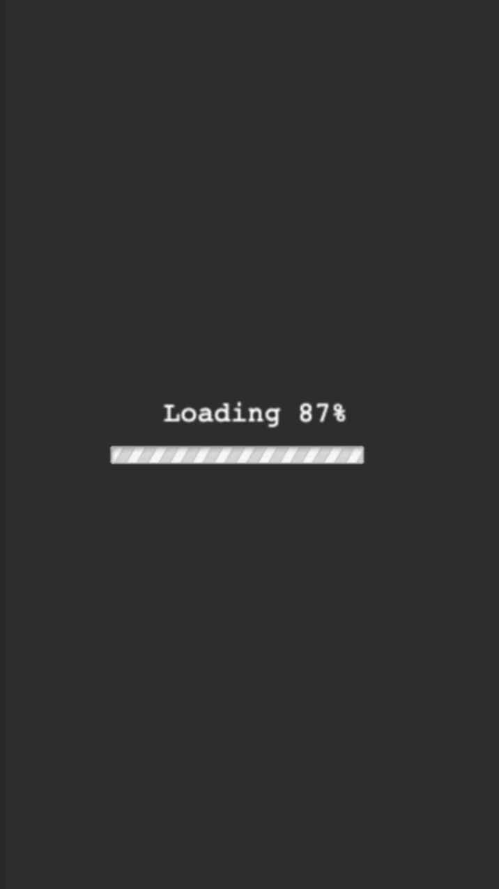
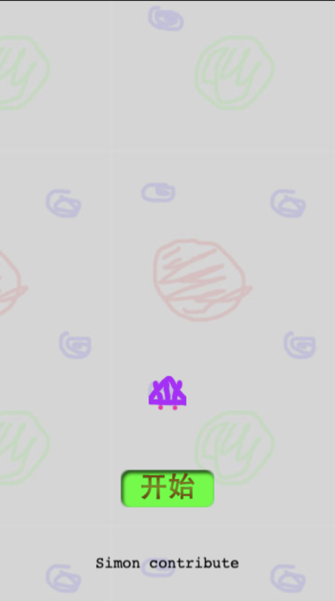
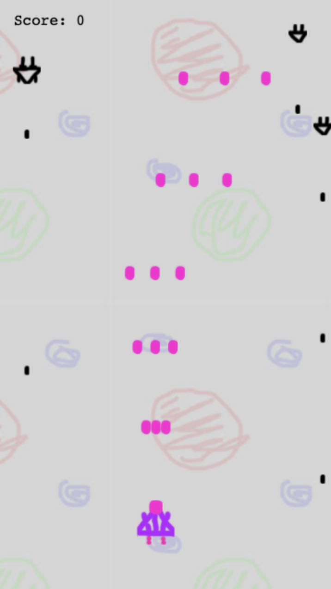
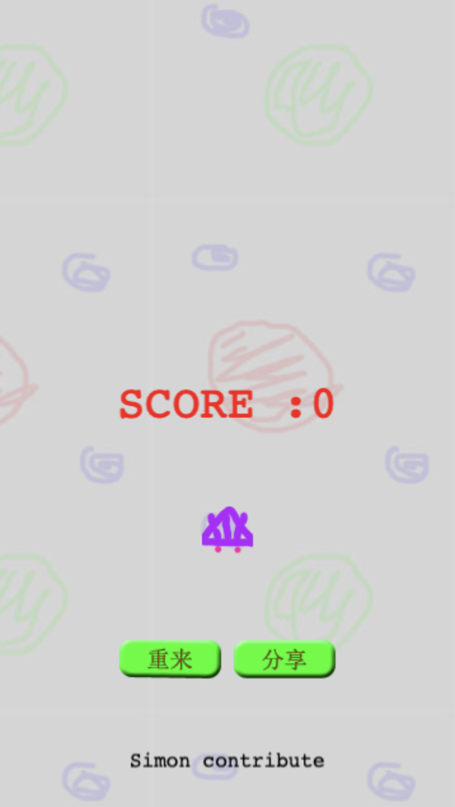

# 基于Phaser3, create-reat-app 开发的飞机大战小游戏
---
## 启动
> `yarn install`

> `yarn start`

## 线上体验
[项目地址](https://simondengshuaihui.github.io/fly-game/build/index.html)

## 项目效果图
### 加载

### 开始

### 游戏中

### 结束

## 开发感受
项目基于Phaser3开发，相对于Phase2各类api和属性都有了比较大的更改，开发过程中也是一边查文档一边Google一边开发，顺带吐槽一下Phaser3的官方文档，结构太复杂，只有英文，对中文开发者不太友好,好在有不少的使用demo可以参考,Phaser3主要结构是分场景开发，就如我项目中分为初始化(这一场景可以视需求跟loading场景合并)、加载、开始、游戏、结束这5个场景，结构相对清晰，开发的时候专注单一场景进行，充分拆分了复杂游戏的结构，让开发过程变得更清爽简单，Phaser3也升级了自己的渲染引擎，看资料是比Phaser2的pixi拥有更好的性能，项目中也用到的对象池的原理来提高项目的性能，详细实现可以参看源码